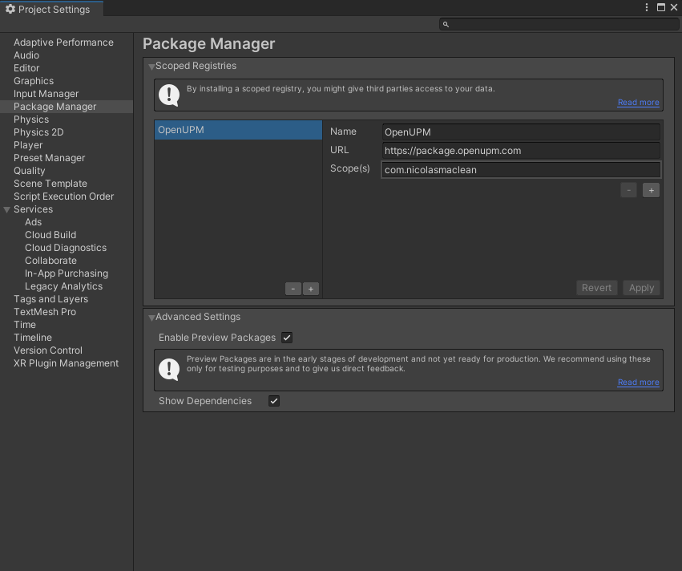
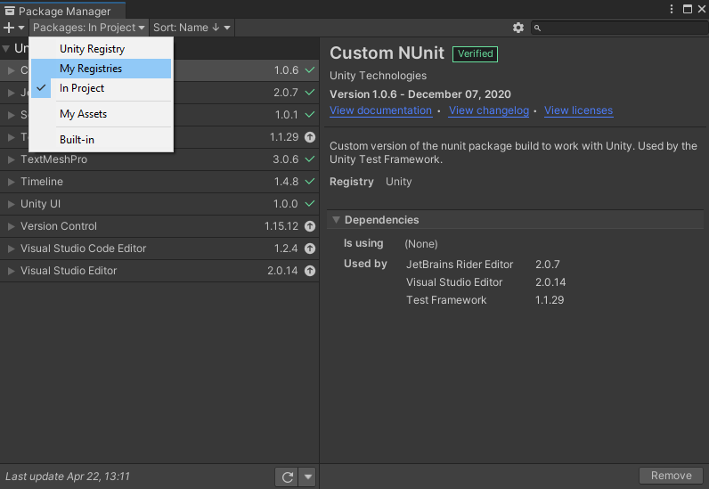
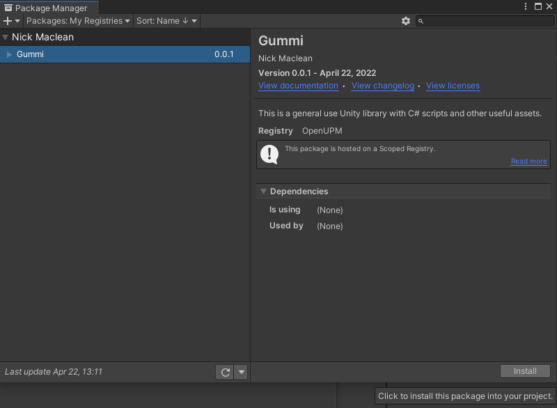
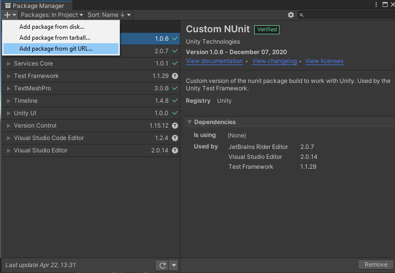

# Installation

## UPM (recommended)

Unity 2020.1 or higher is necessary to leverage this method. Installing from git is the recommended alternative.

### Setup the Scoped Registry

In Unity, Open the Edit > Project Settings window

Navigate to the Package Manager tab

Add the OpenUPM registry

1. Skip this your project already has this
2. Name: `OpenUPM`
3. URL: `https://package.openupm.com`

Add the scope `com.nicolasmaclean`

### Install from Package Manager

Open `Window` > `Package Manager` and view `My Registries`

Install Gummi

## GitHub

In Unity, open the Window > Package Manager window

Click the `+` button in the top-left and choose "Add package from git URL"

Enter the following URL: `https://github.com/nicolasmaclean/Gummi-Unity.git`
